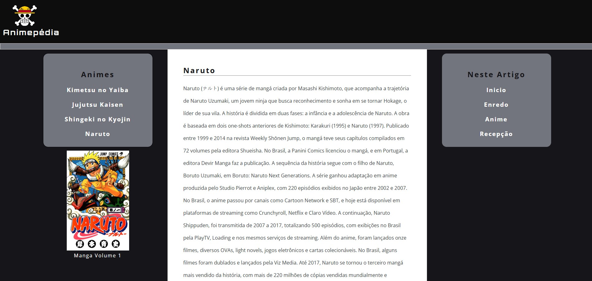

# Pagina Web - Animepedia

Projeto desenvolvido durante o Bootcamp Santander Front-end, com o objetivo de criar uma página web informativa inspirada na estrutura da Wikipédia. Com foco em boas práticas de semântica e organização de conteúdo. O tema escolhido foi animes populares, proporcionando uma experiência visual agradável e acessível ao usuário."

## 🚀 Tecnologias Utilizadas

- HTML5
- CSS3
- Git & GitHub

## 📸 Imagem do Projeto



## 🌐 Deploy Online

Acesse: [Animepedia]( #)

## 🛠️ Como Rodar Localmente

1. Clone o repositório:
```bash
git clone #
```
2. Acesse a pasta:
```bash
cd #
```
3. Abra o `index.html` no navegador.


## 🧑‍💻 Autor

**Andrew Vieira**  
[LinkedIn](https://www.linkedin.com/in/andrew-vieira-24532a1b9/) • [GitHub](https://github.com/Andrew-Vieira)

## 📄 Licença

Este projeto está licenciado sob a **MIT License** – veja o arquivo [LICENSE](./LICENSE) para mais detalhes.